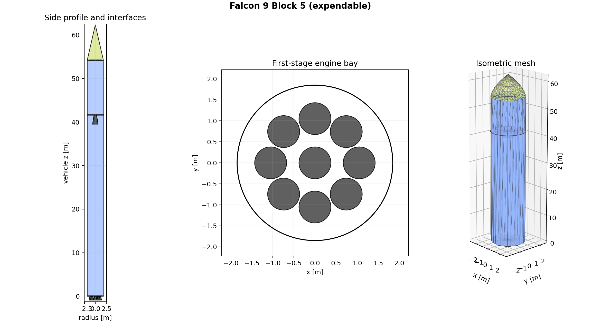
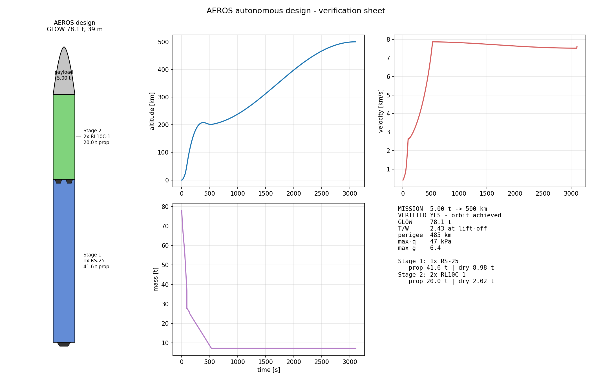
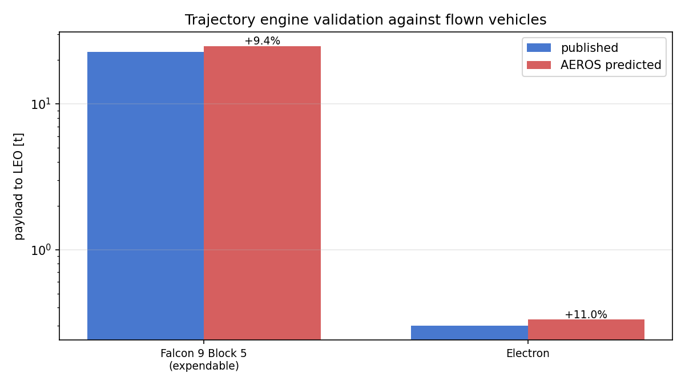
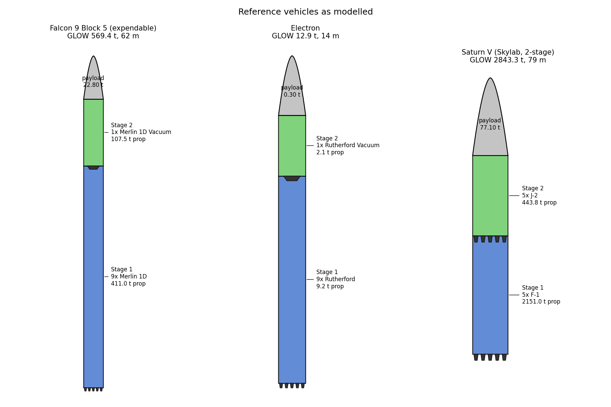

# AEROS — Autonomous Engineering & Reasoning for Orbital Systems

[](https://github.com/JISSAL-GIGI/aeros/actions/workflows/ci.yml)

**An autonomous launch-vehicle design engine whose physics is validated against rockets that actually flew.**

Give AEROS a mission — *"5 tonnes to 500 km"* — and it designs a complete multistage launch vehicle: engine selection, staging, propellant loads, tank structure, and dimensions. Then it **proves the design works** by flying it in a 3-DOF trajectory simulator, and it shows you every engineering decision it made, with the reasoning.

No neural network guesses a rocket here. Every number comes from physics you can check.

```
$ aeros design "5000 kg to 500 km"

Mission: 5.00 t to 500 km (launch lat 28.5 deg)

AEROS design: GLOW 78.1 t, lift-off T/W 2.43, ideal dv 9018 m/s
  Stage 1: 1x RS-25, prop 41.6 t, dry 8.98 t, burn 81 s
  Stage 2: 2x RL10C-1, prop 20.0 t, dry 2.02 t, burn 431 s

VERIFICATION: orbit achieved (perigee 485 km, max-q 47 kPa, max accel 6.5 g)

DECISIONS:
  [delta-v budget] 8958 m/s
      why: circular velocity at 500 km plus standard gravity/drag/steering
      losses, minus Earth-rotation credit at 28.5 deg latitude
  [architecture] 2-stage, 1x RS-25 + 2x RL10C-1, 2.86 m core
      why: minimum-GLOW architecture out of 30 sized candidates; closest
      competitor: Raptor 2/RL10C-1 at 86.3 t GLOW
  ...
```

And now the same design can be exported as concept CAD:

```
$ aeros cad "5000 kg to 500 km" --out cad_out/

CAD export:
  obj: cad_out/vehicle.obj
  stl: cad_out/vehicle.stl
  scad: cad_out/vehicle.scad
  manifest: cad_out/vehicle_manifest.json
  review_png: cad_out/vehicle_cad_review.png
  review_json: cad_out/vehicle_cad_review.json
```





## The validation is the point

Anyone can generate a rocket-shaped drawing. The question is whether the physics engine that sized it can be trusted. AEROS answers that by flying **real vehicles, built from their published stage masses and engine data**, through the exact same simulator, and comparing predicted payload capacity with the operators' published figures:

| Vehicle | Published payload | AEROS prediction | Error |
|---|---|---|---|
| Falcon 9 Block 5 (expendable, 200 km LEO) | 22.8 t | 24.95 t | **+9.4%** |
| Rocket Lab Electron (200 km LEO) | 300 kg | 333 kg | **+11%** |
| Saturn V two-stage (Skylab, 435 km / 50°) | 77.1 t flown | mission reproduced, capacity ≈ 121 t | ✓ |



The simulated flights also reproduce flight-measured quantities that were never fitted: maximum dynamic pressure comes out at 29–36 kPa across all three vehicles (Falcon 9 flies ~33 kPa in reality), and staging velocities and accelerations land in the flown ranges.

**About the +10% bias:** it is consistent and explainable. The simulator flies ideal guidance with no flight-performance reserve, no wind dispersions, and no operator margin — so it should slightly exceed published (conservative) figures, and it does, by a similar amount on a 13 t rocket and a 550 t one. We consider honest, characterized bias more valuable than a suspiciously perfect fit.

Reproduce it yourself: `aeros validate` (takes a while — it re-optimizes ascent steering at every bisection step).



## What's inside

- **`aeros/atmosphere.py`** — US Standard Atmosphere 1976, seven-layer implementation, unit-tested against the published tables.
- **`aeros/engines.py`** — database of real, flown engines (Merlin, Raptor, RS-25, F-1, J-2, RL10, Rutherford) with exact nozzle back-pressure relation `F(p) = F_vac − A_e·p`; the model's sea-level Isp must reproduce each engine's published value within 3% (unit-tested).
- **`aeros/trajectory.py`** — 3-DOF ascent dynamics with adaptive RK45: air-relative aerodynamics over a rotating Earth, Mach-dependent drag, q·α structural steering envelope, automatic max-q throttle bucket, two-burn orbital insertion, differential-evolution steering optimization, payload capacity by bisection.
- **`aeros/structures.py`** — stage dry-mass buildup: hoop-stress-sized tank shells, engine and thrust-structure masses, calibrated to reproduce four flown stage masses within ±10% (unit-tested).
- **`aeros/design.py`** — the autonomous designer: enumerates engine architectures, sizes each to mass closure, optimizes staging and diameter for minimum GLOW, verifies the winner by simulation, and logs every decision with its rationale.
- **`aeros/cad.py`** — concept CAD generation: OBJ/STL/OpenSCAD export, explicit thrust/stage/payload interface markers, corrected clustered engine layouts, a JSON engineering manifest, and rendered CAD review sheets with automated geometry checks.
- **`aeros/validate.py`** — the reference vehicles and the validation harness.
- **`aeros/plots.py`** — vehicle drawings, ascent profiles, and one-page design verification sheets (matplotlib only).
- **`docs/space_problem_intelligence_2026.md`** — official NASA/ESA problem-intelligence note explaining why CAD + structured design data is the next AEROS layer.

## Quickstart

```bash
git clone https://github.com/JISSAL-GIGI/aeros
cd aeros
pip install -e .[dev]
pytest tests/ -q
python examples/design_demo.py
aeros cad "1500 kg to 400 km" --out my_cad/
aeros design "1500 kg to 400 km" --out my_design/
```

Requires Python ≥ 3.10, numpy, scipy, matplotlib. No GPU, no CAD kernel, no external simulation software. The first CAD layer writes OBJ/STL/OpenSCAD directly from Python and emits a review PNG plus JSON checks for stack continuity, engine clearance, interface markers, and fairing placement.

## What this is not (yet)

We are explicit about scope, because trust requires it:

- **3-DOF, planar, spherical Earth.** No 6-DOF attitude dynamics, no winds, no dispersions, no J2. Adequate for conceptual capacity studies (as the validation shows), not for mission design.
- **Conceptual-level structures.** Mass-estimating relationships calibrated on flown stages — not FEA. The ±10–15% structural accuracy bounds the design fidelity.
- **Concept CAD, not production CAD.** The CAD exporter creates inspectable stage/fairing/engine/interface geometry, a structured manifest, and visual review artifacts; it is not yet a watertight, tolerance-controlled, fabrication-ready STEP assembly.
- **Expendable two-stage designs.** Reusability penalties, boost-back budgets, parallel staging (boosters), and 3+ stage optimization are on the roadmap.
- **No costing.** GLOW is the current objective; cost models are deliberately excluded until they can be sourced credibly.
- **Published-data uncertainty.** Reference stage masses carry real uncertainty (SpaceX does not publish exact dry masses); the validation errors should be read with that in mind.

## Roadmap

AEROS is the first published layer of a larger effort — an autonomous engineering system that goes from mission statement to validated design with full decision traceability. Next layers, in order:

1. **Multi-objective design** — Pareto fronts over GLOW / cost / reliability instead of single-objective GLOW.
2. **Higher-fidelity verification loop** — 6-DOF trajectory, load cases, and automated FEA hand-off for the structures the conceptual sizer proposes.
3. **CAD interface intelligence** — explicit attachment points, load paths, standard interfaces, manufacturing constraints, and optional STEP export through a CAD kernel.
4. **Parallel staging and reusability** — boosters, propulsive recovery budgets.
5. **Knowledge layer** — requirements parsing and design-rule extraction from the open engineering literature, feeding the same verified physics core.

## License

MIT. Built to be checked, challenged, and extended — if you find a physics error, please open an issue; that is the entire point of publishing the validation.
